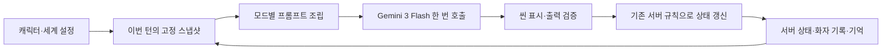

# Lucid Chat 시스템 프롬프트 구조 개선 계획

> 후속 모델 결정(2026-09-24): 사용자 요청으로 기본 Flash 모델을 Gemini 3.8 Flash로 갱신했다. [결정 정본 §I](19_assets/decisions_confirmed.md). 아래 Gemini 3 유지와 실측 결과는 9/22까지의 기록이며, 이번 변경으로 프롬프트 실험을 재개하거나 결과를 재해석하지 않는다.

최종 P1 확인: **2026-09-22**. 최신 상태: **모델·프롬프트 탐색 종료 / master ca27320의 로컬 수리 및 P1 수용 확인 68회 완료 / 미배포**. 최신 판단은 [P1 수용 보고서](28_assets/p1-acceptance-2026-09-22.md)와 §19를 우선한다. §18의 `feature/diorama` 미통합 상태는 앞선 감사 시점의 관측이며, 이번 턴 시작 때 수리가 복원된 상태를 확인했다. 이 세션이 브랜치 전환이나 복구 패치 적용을 수행한 것은 아니다. 자유 모드 지연 증가와 오프닝 주관 감각 등의 잔여 품질 문제를 포함해 종료한다. §1–18의 계획·실험·검사는 각 기록 시점의 사실로 보존한다.

사용자 결정: Gemini 3 Flash 유지, 모델 베이크오프 종료. 시스템 프롬프트는 서비스의 핵심 UX이므로 버그 수리에 한정하지 않고 구조와 방법론을 검토한 뒤 구현한다. 초기 검토 시점에는 운영 프롬프트·소스·DB·비교실 실행 조건을 변경하지 않았다. 이후 사용자의 ‘좋다. 시작해라’ 지시로 §14의 실험 준비를 구현했다.

근거: BE `codex/llm-bakeoff-lab`, HEAD `ca27320c1b788fe8dd88edb320cfcc2ce735aa89`; 기존 미커밋 비교실 작업 보존. [기존 감사·결정](27_LLM_Bakeoff_Prompt_Audit.md), [사용자 첫 실험 분석](27_assets/bakeoff-results-2026-09-18.md), [현재 조립 구조 실측](27_assets/prompt-structure-2026-09-18.json). 운영 DB의 현행 시드·사용자 장기 대화는 조회하지 않았다.

## 1. 권고와 근거의 범위

**페르소나 부여는 유지하되, 인물의 동기·상황·관계·지식이 실제 반응으로 연결되는 구조로 발전시키는 것이 권고안이다.** ‘너는 로제타다’를 다른 멋진 역할 문장으로 바꾸는 것만으로 큰 효과를 기대하지 않는다. 개선의 단위는 역할 문구뿐 아니라 매 턴 전달하는 정보, 그 정보의 우선순위, 행동 예시, 기록의 보존 방식, 평가 체계다.

‘You are X’가 이미 폐기된 기법이거나 이를 대체할 보편적인 RP 정답이 등장했다는 근거는 확인하지 못했다. 현재 Google 가이드도 역할·핵심 제약·출력 계약을 앞에 명확하게 두는 방식을 설명한다. 이는 역할 부여가 충분하다는 뜻은 아니다. [Google prompt design](https://ai.google.dev/gemini-api/docs/prompting-strategies)

공식 일반 가이드, 특정 RP 연구 결과, 이 저장소에서 직접 관측한 결함, Lucid에 적용할 설계 가설은 구분한다. 초기 설계 시점에는 **한국어 Gemini 3 Flash**에서의 개선을 실험하지 않았으며, 이후 실측은 §15에 기록했다. 연구의 평가 점수·개선율을 서비스의 예상 개선율로 옮기지 않는다.

추천 투자 순서:

1. 인물 표현과 정보 전달의 구조를 개선하는 단일 호출 프롬프트.
2. 캐릭터별 한국어 행동·말투 예시와 대표 상황 평가.
3. 현재 상태·화자·지식·기억이 다음 턴까지 정확하게 이어지는 구조.
4. 검증된 후보의 출력 순서·스키마·캐시·추론 설정 최적화.
5. 앞 단계로 해결되지 않는 문제에만 추가 생성 호출·검색·학습을 검토.

## 2. 현재 구조는 어디까지 발전해 있는가

### 2.1 이미 있는 설계와 보존할 이유

| 현재 구성 | 직접 확인한 근거 | 판단 |
|---|---|---|
| V1 캐릭터의 역할·배경·가치·약점·말버릇 | `CharacterPromptAssembler.java:93–154` | 단순한 한 줄 페르소나보다 이미 풍부하다. 캐릭터 데이터를 버릴 이유가 없다 |
| 관계 단계별 행동 지침·스탯·난이도 | 같은 파일 `:288–337`, `buildBehaviorGuide` | 상태에 따른 변주가 이미 있다. 현재 지시 사이의 우선순위와 구체 표현을 정리할 대상 |
| V1 고정/동적/출력 분리 | 같은 파일의 `SystemPromptPayload`, `ChatStreamService.java:1458–1519` | 분리 의도는 좋다. 실제 고정 부분에 변동 데이터가 섞이는지 바로잡을 가치 |
| V2 감독과 개별 인물 연기 구분 | `StoryDirectorPromptAssemblerV2.java:202–216` | ‘감독 방식 도입’을 신규 혁신으로 제안하면 중복이다 |
| V2 static/dynamic·등장/비등장 인물 구분 | 같은 파일 `:99–135`, `:429–505` | 세계와 인물 상태를 조립하는 뼈대는 유지 |
| V2 열린 서사·오프닝·scenes-first | 같은 파일 `:148–195`, `:653–754` | 전개와 턴 표시를 이미 고민한 흔적. 장면 수·전개 책임을 별도로 검증 |
| 서버의 게임 상태 처리, 기존 DTO/표시 계약 | 각 stream service와 후처리 | 프롬프트가 승급·장소·권한의 최종 결정권을 가져가도록 바꾸지 않는다 |

### 2.2 실제 전송 형태와 크기

공식 시드 로제타 1명, STRANGER·스탯0·기억없음, 입력 ‘나 말이야? 무슨 일인데?’를 기존 Java bridge로 무료 조립했다. 원본 assembler를 실행했고 모델 추론은 하지 않았다. **아래 길이는 UTF-16 코드 단위이며 토큰 수가 아니다.** V2 운영의 다인물·긴 기억 요청 대표값으로 일반화하지 않는다.

| 경로 | 실제 메시지 순서 | system 부분 길이 |
|---|---|---:|
| V1 자유 | 고정 system → 입장/공식 인사/유저 입력 → 동적 system → 출력 system | 23,479 + 1,792 + 2,096 = **27,367** |
| V2 스토리 | 고정 system(출력 포함) → 동적 system → 입장/공식 인사/유저 입력 | 14,825 + 650 = **15,475** |

V1 첫 인물 소개 블록은 1,533자이며 별도의 관계별 지침도 있다. 반면 동적 장소 설명 3,847자, 속마음 시스템 2,955자 등 게임·연출 설명의 비중도 크다. 이 분포는 기능 삭제의 근거가 아니다. **한 생성 안에 인물 연기, 장면 묘사, 게임 판정, 시스템 메타데이터 작성이 섞여 있다는 설계상의 관측**이다. 이름이 SANDBOX여도 활성 경로는 멀티씬·장소·연출을 포함한다. 옛 미사용 단일 씬 함수를 기준으로 축소하지 않는다.

### 2.3 구조를 고쳐야 할 이유

| 관측 | 구조적 원인 후보 | 개선 방향 / 아직 모르는 점 |
|---|---|---|
| 로제타 관계 지침과 공통 ‘공손한 거절·겸손한 칭찬 수용’ 예시가 경합 | 공통 규칙이 특정 인격·말투까지 지정 | 공통에는 행위의 경계를, 캐릭터에는 표현 방식을 둔다. 어느 정도가 더 맛있는지는 사람 평가 |
| V1·V2 외형 누락, 처음 만난 인물의 유저 정보 선취 | 저장된 설정·전송된 사실·인물이 아는 정보가 구분되지 않음 | 외형·지식 접근 범위·공개 여부를 구조화 |
| 고정 부분에 관계 해금 장소·동적 장소·이벤트 조건 포함 | ‘코드상 static’과 ‘요청 간 안정적’이 다름 | 고정 계약/캐릭터와 매 턴 상태 분리. 캐시 실익은 별도 실측 |
| V2 사용자 내적 독백 허용·금지 지시 공존 | 감독의 전지적 서술 권한과 유저의 선택권이 불명확 | 서술 가능한 대상·행위의 경계를 한곳에서 정의 |
| V2 assistant 기록에 화자 표시 소실 가능 | 표시용 cleanContent를 다음 추론용 기억으로 재사용 | 발화자·지문·대사의 구조를 보존하는 history 직렬화 |
| 저장한 누적 인상/감정이 다음 프롬프트에 명시적으로 전달되지 않는 경로 | 출력과 다음 입력의 연결이 일방향 | 서버에 저장하는 상태와 모델에 다시 제공할 상태를 대조 |
| 누적 기억과 최근20로그의 경계, V2 delta 전달 문제 | 턴·로그·요약 범위와 사실 출처가 혼재 | prompt 이전의 데이터 계층 재현·수리 필요 |

추가 V2 근거: 감독의 유저 내면 생성 `StoryDirectorPromptAssemblerV2:216,385,586`과 금지 `:530`; 화자 없는 cleanContent 생성 `ChatStreamServiceV2:714–726`, 재주입 `:790`; 서사 thread 입력에서 id 생략 `:901–918`, 업데이트는 id 사용 `:925–950`. 정적 코드 관측이며 실제 다인물 오인율·thread 중복 발생률은 미측정이다.

V2 인물 정의 `StoryDirectorPromptAssemblerV2:343–368`에도 appearance/clothing 주입이 없다. 로제타 외형 수리는 V1만 대상으로 삼지 않는다. 누적 인상은 `ChatStreamServiceV2:865–874`에서 저장하지만 해당 assembler에 `getCharacterThought/getLastEmotion` 읽기가 없다. 유효한 과거 인상/감정을 다시 사용할 때는 생성값이라는 출처와 시점을 표시하고 확정 게임 상태보다 우선하지 않게 한다.

## 3. 최근 방법론에서 채택할 부분

자료는 모두 2026-09-18 조회했다. 아래 ‘Lucid 적용’은 해당 자료를 바탕으로 한 설계 판단이다.

| 자료·시점 | 확인되는 접근 | Lucid 적용·한계 |
|---|---|---|
| [Google Gemini prompt design](https://ai.google.dev/gemini-api/docs/prompting-strategies), 현재 가이드 | 명확한 역할·제약, 구획, 다양한 입출력 예시. 내부 thinking과 답변에 적는 사고 설명을 구분 | 우선 적용 근거. RP 전용 성능 보장은 아님. 온도/추론 권고는 프롬프트 수정과 별도 실험 |
| [Anthropic context engineering](https://www.anthropic.com/engineering/effective-context-engineering-for-ai-agents), 2025-09-29 | 매 턴의 전체 정보 구성을 설계. 지나친 if-else와 추상적 구호 사이에서 필요한 지시·예시 선별 | 새 용어 자체보다 정보 선별·경계·수명 관리에 적용. 주로 agent 사례이며 한국어 RP 실증은 아님 |
| [MRPrompt](https://arxiv.org/html/2603.19313v1), 2026-03-14 preprint | 인물 지식을 핵심 특성과 상황별 특성으로 묶고, 현재 맥락에 맞는 선택·지식 범위·연기를 연결. 외부 도구/RAG/추가 학습 없는 prompt 방식 | 이번 구조 실험에 가장 직접적. 영어·중국어 중심, 고정 맥락에서 1회 응답 평가. 장기 상호작용 효과는 미검증 |
| [PersonaForge](https://aclanthology.org/2026.findings-acl.386/), ACL Findings 2026-07 | 고정 성격·스타일·동적 상태 분리, 선택적 사고 단계. 복잡한 성격 제약을 통합하지 못하면 단순 baseline보다 악화 | 분리 개념을 참고. 심리 척도 전체나 별도 사고 체인을 그대로 도입하지 않음. Gemini2.5Flash 중심이며 현재 대상 모델/한국어 전이는 미검증 |
| [RoleBreak](https://aclanthology.org/2025.coling-main.494/), COLING 2025-01 | 인물 범위 밖 질문·설정 충돌과 캐릭터 이탈, 상호작용 지속의 균형 평가 | 지식 경계·설정 충돌 평가 사례 참고. 캐릭터 이탈을 다룬 연구이며 콘텐츠 필터 회피 설계로 사용하지 않음 |
| [InCharacter](https://aclanthology.org/2024.acl-long.102/), ACL 2024-08 | 인물이 성격을 설명하는 말과 상황에서 보이는 행동을 구분해 평가 | 소개 문장 재현보다 실제 반응 평가. 심리검사 수치를 제품의 정답으로 삼지 않음 |
| [RolePlot](https://aclanthology.org/2025.acl-long.603/), ACL 2025-07 | 인물 일관성과 별도로 전개의 적절한 시점을 평가 | 장면 유지/작은 변화/사건 전환을 구분. 연구 전체는 데이터·임베딩 기반 구성도 포함하여 prompt-only 성과로 소개하지 않음 |
| [BOOKMARKS](https://arxiv.org/html/2605.14169v1), 2026-05-13 preprint | 목적·관계 등에 관한 질문과 답, 시점을 갖는 기억을 선택·갱신 | 장기 기억 후속 참고. 다단계 검색/생성 체계, 원작 다음 행동 재현 평가이며 지금 전면 도입할 이유는 부족 |
| [RoleLLM](https://aclanthology.org/2024.findings-acl.878/), ACL Findings 2024-08 | 프로필·고유 지식·발화 스타일·학습을 구분 | 구획화 자체는 최근 갑자기 생긴 기법이 아님. fine-tuning 효과를 few-shot 효과로 오인하지 않음 |

[OpenAI 일반 가이드](https://developers.openai.com/api/docs/guides/prompt-engineering)도 identity/instructions/examples/context와 코드 기반 버전·평가를 설명한다. 이는 공급자 중립 설계의 참고이며 Responses API로 전환하거나 다른 모델로 갈 이유로 사용하지 않는다. Google의 옛 [Gemini 3 개발 가이드](https://ai.google.dev/gemini-api/docs/gemini-3)는 현재 폐기 예정 안내가 있으므로 세부 요청 형식은 현행 OpenRouter/provider 계약을 다시 확인해야 한다.

## 4. 목표 구조: 같은 사실에서 상황에 맞는 인물 반응으로

현재 assembler를 전면 폐기하기보다, **필요 데이터를 모으는 단계**와 **모델에 전달할 텍스트를 만드는 단계**를 분리한다. 처음에는 기존 출력과 동일한 결과를 만드는 경로를 두어 기술 리팩터링과 창작 지시 변경을 섞지 않는다.

스냅샷은 거창한 새 플랫폼이 아니라, 지금 assembler가 필요로 하는 데이터를 타입과 출처가 있는 입력으로 모은 것이다. 서버 상태와 읽기 전용 캐릭터 설정을 묶되 비동기 요약이 어느 턴까지 반영됐는지 표시한다. 초기 단계부터 외부 프레임워크·벡터 DB·별도 모델 서버를 추가하지 않는다.

### 4.1 고정 정보와 매 턴 정보

| 구획 | 내용 | 수명·권한 |
|---|---|---|
| 서비스 계약 | 모드 역할, 유저 행위 경계, 출력/게임 규칙 | 코드가 관리하는 규칙 |
| 인물·세계의 확정 설정 | 외형, 배경, 관계 없는 핵심 가치, 능력의 한계 | 설정 버전·서버가 판정한 유효 모드별. UGC 내용이 서비스 계약을 덮어쓰지 않음 |
| 행동·말투 기준 | 욕구/방어 방식, 관계에 따른 표현, 대표 한국어 예시 | 캐릭터·모드 버전별. 예시는 대화 사건이 아님 |
| 현재 장면과 관계 | 현재 장소/시간/등장인물/관계/스탯/유효한 신호 | 서버가 확정한 이번 턴 상태 |
| 인물별 지식 | 목격·공유·추측·비공개 사실의 구분 | 인물·사건·시점별 |
| 최근 대화와 필요한 기억 | 화자 포함 기록, 미해결 약속/사건, 관련 기억 | 턴 범위·출처·갱신 시점 포함 |
| 이번 입력 | 실제 유저 대사/명시 행동 | 입력 자체는 관측 사실. 유저의 주장 내용이 곧 세계의 확정 사실은 아님 |

V1의 마지막 동적 system과 V2의 앞쪽 동적 system 중 어떤 배치가 더 나은지는 별도 A/B로 확인한다. 한 포맷을 무조건 정답으로 지정하지 않는다. 먼저 내용과 경계를 정리하고, 그다음 순서를 시험한다. 안정적인 공통 prefix는 캐시 후보가 되지만 캐시 적중을 보장하지 않는다.

일반/시크릿의 유효 모드는 snapshot과 캐시/프롬프트 버전에 포함한다. 현재 V1은 effectiveSecretMode에 따라 personality/tone을 선택하고 V2도 별도 정의를 선택한다(`CharacterPromptAssembler:144–145`, `Character:470–480`, `StoryDirectorPromptAssemblerV2:325–328`). 새 공통 인물 구획이 이를 일반 모드 정의로 덮어쓰지 않도록 한다. 시크릿 3축 등 모드별 출력 필드 계약도 함께 보존한다.

### 4.2 규칙의 우선순위는 유형별로 정의

‘모든 상황에서 무조건 캐릭터성 최우선’ 같은 문장을 여러 곳에 반복하는 대신, 충돌 유형을 정한다.

- 게임 상태 충돌: 서버에서 확정된 상태가 기준이며 모델 출력은 검증할 제안이다.
- 인물 설정 충돌: 생성된 과거 묘사가 공식 설정을 몰래 고쳐 쓰지 않게 한다. 예: 첫 답변에서 만들어진 보라색 눈이 공식 붉은 눈을 대체하지 않음.
- 유저 행동: 직접 적은 행위에는 반응하되 명시되지 않은 접근·접촉·결심·속마음을 확정하지 않는다.
- 인물 심리: 핵심 가치/욕구는 지속되고, 순간 감정과 공개하는 정도는 사건·관계에 따라 달라진다.
- 사용자 인식 렌즈: 기존 제품 기능을 유지하며 첫인상/해석에 반영한다. 렌즈의 높은 수치가 곧 높은 관계·비밀 공개 권한·성격 교체를 의미하지 않도록 뜻을 구분한다. `PersonaLensPromptBlock:44–57,78–92`의 현재 강한 예시와 관계 지침을 함께 대조한다.
- 일상적 창작: 설정을 위반하지 않는 작은 동작·분위기·대화 제안은 허용한다. 모든 세부를 ‘정보 없음’으로 응답하게 만들지 않는다.

이 우선순위는 심리 전체를 서버 if-else로 결정하자는 뜻이 아니다. 사실·권한 경계만 확실히 두고, 표현의 선택은 모델에 남긴다.

## 5. 가장 중요한 창작 개선: 성격을 반응으로 연결

### 5.1 로제타 예시 — 제작 의도 확인용 초안

아래는 **새 캐릭터 설정 확정이나 운영 프롬프트가 아닌 설계 예시**다. 원본 설정의 ‘높은 자부심·인정 욕구·숨겨진 소심함·STRANGER에서 드러내지 않는 수줍음’을 어떻게 연결할지 보여준다.

| 요소 | 전달할 의미 |
|---|---|
| 지속되는 욕구 | 자신의 재능을 인정받고 상호작용의 주도권을 지키고 싶다 |
| 기본 표현 | 능청스러운 도발, 여유 있는 반문, 자신을 높이는 표현. 상황마다 말버릇을 전부 사용하지 않는다 |
| 칭찬을 받았을 때 | 인정 욕구는 자극되지만, 낯선 상대 앞에서는 우월감을 유지하려고 장난으로 받아넘길 수 있다 |
| 만만치 않은 상대 | 즉시 굴복하거나 무조건 공격하기보다 호기심·경쟁심·체면 지키기 중 상황에 맞는 방식으로 반응 |
| 실제로 두려운 상황 | 겁을 느낄 수 있다. 허세를 유지하려는 마음과 두려움이 함께 드러날 수 있으며 모든 위협에 같은 강도로 붕괴하지 않는다 |
| 가까운 관계 | 같은 욕구라도 더 직접적인 인정 요청·솔직함으로 표현될 수 있다. 관계 전이는 서버 상태를 따른다 |

핵심 가설은 **자극 → 인물의 욕구/해석 → 관계에 따른 공개 정도 → 대사/행동**의 연결이다. 이를 장황한 사고 과정을 매 턴 출력하게 만들지 않는다. 로제타가 겁을 먹으면 안 된다는 새 성격을 씌우지도 않는다.

예시 입력: ‘잘난 척하길래 칭찬해주기 싫었는데, 방금 건 좀 멋졌다.’

예시 반응 초안: ‘후훗~ 칭찬 한마디 하는 데 조건도 많네? 뭐, 보는 눈은 있는 걸로 해줄게.’

이 대사는 Codex가 설계 설명용으로 작성한 예시이며 제작자 검수 전이다. Gemini 실측 결과나 평가의 정답으로 삼지 않는다. 얼굴 붉힘·호감 상승·비밀 고백을 자동으로 동반시키지 않고도 칭찬에 반응하는 방식의 예다. 이런 예시 2~4개를 우선 만들고, 단순 복사·고정 문형 반복이 늘어나는지도 비교한다.

### 5.2 예시는 무엇을 가르칠 것인가

- 일상 반응 하나, 반대/거절 하나, 감정이 흔들리는 상황 하나 등 서로 다른 기능을 보여준다.
- 로제타의 예시를 모든 UGC에 공통 주입하지 않는다. 범용 규칙은 특정 인격의 겸손·친절·공격성을 강요하지 않는다.
- 예시에는 그때의 관계/상황을 붙이고 현재 사건과 분리한다. 프롬프트 예시가 실제 약속·기억으로 전파되는지 검사한다.
- 생성되는 한국어의 호칭·반말/존댓말·종결어미·문장 리듬을 평가한다. ‘자연스러운 한국어로’라는 구호만 추가하지 않는다.
- 좋은 예시를 기본으로 전달한다. 대량의 나쁜 예시와 금지 문형을 늘어놓는 방식은 별도 검증 없이 채택하지 않는다.
- UGC는 기존 자유서술을 우선 보존한다. 새 구조로 정리할 때 원문에 없는 성격/설정을 발명하지 않으며 누락 필드의 처리와 제작자 편집 가능성을 설계한다.

## 6. 지식·상태·장면 진행의 책임 분리

### 6.1 모델에 알려준 정보와 인물이 아는 정보

서비스가 유저 이름을 안다고 해서 처음 만난 인물이 과거·생각·숨겨진 프로필까지 아는 것은 아니다. 이름을 사용할 때의 정본은 기존 프로필 이름 정책을 유지하면서, **극중에서 이름이 소개됐는지**를 별도로 다룬다.

예: 시스템의 프로필 이름은 지우, 로제타에게 소개됐는지는 미확인, 현재 눈앞에 있는 상대임은 확인. 이렇게 구분하면 모르는 이름을 매번 망각하는 문제와 처음부터 다 아는 문제를 따로 검사할 수 있다. 인물에게 보이지 않는 사건은 세계 기록에 있어도 해당 인물의 확정 기억으로 옮기지 않는다.

다만 V2 현행 `:522`는 모든 캐릭터가 프로필 이름으로 부르며 ‘당신’ 등의 대체 호칭을 쓰지 말라고 명시한다. 따라서 소개 전 이름 사용을 늦추는 것은 단순 누락 수리를 넘어 **호칭 UX 지침 조정 후보**다. 이름의 정본 정책을 유지하는 것과 사용 시점을 바꾸는 것을 구분해 계획 검토에서 결정하며, 기존 요구를 이미 지키는 출력에 임의로 실패 점수를 주지 않는다.

정보 전부를 한 문장으로 ‘제공된 사실만 사용’하도록 제한하면 창작이 굳을 수 있다. 고정 설정·비밀·개인 지식은 엄격히 다루고, 무해한 장면 묘사·가능성에 대한 추측·질문은 캐릭터다운 방식으로 허용한다. 비공개 정보를 구획 태그만으로 완전히 숨길 수 있다고 주장하지 않는다. 공개되면 안 되는 구체 내용은 해당 인물의 입력에서 빼는 접근을 우선한다.

단일 호출에서 감독이 여러 인물의 비밀을 동시에 받아야 하는 경우, 인물별 태그는 논리적인 연기 경계이며 강제 접근 제어가 아니다. 불필요한 비밀을 제외하고, 서사상 꼭 필요한 비공유 정보는 지식 누출 평가 대상으로 둔다. 중요한 실제 비공개 데이터의 접근 통제를 RP 지시로 대체하지 않는다.

### 6.2 대화 연기와 사건 진행

V2는 이미 감독 역할이다. 추가 개선은 ‘누가 말하는가’, ‘그 인물이 무엇을 원하는가’, ‘지금 사건을 움직일 때인가’를 별도 입력/평가 대상으로 만드는 것이다.

- 장면 유지: 질문·갈등을 소화할 시간이 필요하면 새 사건을 억지로 만들지 않는다.
- 작은 변화: 캐릭터의 행동·관찰·제안으로 다음 턴을 열어준다.
- 사건 전환: 유저의 선택이나 유효한 세계 신호에 근거해 진행한다.

매 턴 cliffhanger·질문·새 NPC·강한 감정을 강제하면 반복과 과장이 생길 수 있다. ‘유저가 다음에 할 말이 생기는가’를 평가하되 사건 수·씬 수가 많다는 이유로 높은 점수를 주지 않는다. V2의 기존 지침은 **목표4~5씬, 허용 최소3·최대5씬**(`:722`)이다. 정상3씬을 새 오류로 만들지 않으며, 이 범위를 조정하려면 표시·페이싱 정책의 별도 실험으로 취급한다.

### 6.3 단일 호출 유지, 사고 체인은 선택 실험

첫 목표 구조는 여전히 Gemini 한 번 호출이다. 내부적으로 인물 연기와 장면/상태 책임을 구분하는 것과, 감독→배우→비평가를 서로 다른 호출로 실행하는 것은 다르다.

현재 V1 `reasoning` 문자열은 스트림의 첫 씬보다 먼저 생성되는 출력 필드다. 공급자의 내부 thinking과 동일한 것이 아니다. 이를 줄이기/제거하기/씬 뒤로 옮기기는 서로 다른 실험이며, 스탯 판단이나 장면 일관성을 함께 확인한다. Google도 내부 thinking이 있는 모델에서 사고 단계를 답변에 따로 서술하는 것이 일반적으로 필수는 아니라고 설명한다. [Google thinking 관련 지침](https://ai.google.dev/gemini-api/docs/prompting-strategies#enhancing-reasoning-and-planning)

추가 호출이 필요한지는 단일 호출 후보가 구체적인 실패 유형에서 정체된 뒤 판단한다. 유저가 기다리는 경로의 호출 수·추론 토큰·첫 씬 지연을 모두 비용으로 계산한다.

## 7. 기억은 별도 데이터 문제까지 함께 다룬다

기억 저장소를 곧바로 벡터 DB로 교체하지 않는다. 우선 현재 로그/요약 경계와 V2 주기·delta 누적 문제를 재현하고, 다음 네 가지를 구분해 전달하는 구조를 설계한다.

1. 현재 확정 사실: 장소·등장인물·관계·유효한 이름/호칭.
2. 인물별 의미 있는 기억: 관찰한 사건·약속·현재 상대에 대한 인상.
3. 진행 중인 것: 미해결 대화·사건·의도. 기존 thread id와 상태를 함께 보존.
4. 최근 발화: 화자와 지문/대사를 유지한 원문 구간.

목표 기억 항목에는 출처 turn/log ID, 아는 인물, 유효 시점, 사실/추측 구분이 필요하다. 아래는 이미 저장된 정보와 앞으로 추가해야 할 정보를 구분한 것이다. context loader를 만드는 것만으로 없던 출처가 생기지는 않는다.

| 정보 | 현재 확보할 수 있는 근거 | 초기 처리 / 후속 작업 |
|---|---|---|
| 캐릭터·세계 설정, 현재 관계·장소·등장 여부 | 기존 설정/방 상태 | 원래 출처를 표시해 전달. 현재 등장 여부로 과거 목격 여부를 역산하지 않음 |
| 최근 발화·씬 | 기존 원문 로그와 저장된 scenes | 기록에 있는 화자·지문을 보존. 누락된 과거 정보를 확정값으로 복원하지 않음 |
| 요약 시점 | `MemorySummary.turnNumber/createdAt`, `HeroineMemorySummary.turnNumber/createdAt` | 기존 값을 보존하되 현재 생성 주기 문제 때문에 정확한 원문 포함 범위를 뜻한다고 가정하지 않음 |
| 인물별 요약 구분 | `HeroineMemorySummary.characterId/sourceMode` | 어느 인물·모드의 요약인지 보존. 각 사실을 언제 목격했는지는 별도 문제 |
| 정확한 요약 원문 구간·사실별 출처 log ID | 현재 요약 엔티티에는 명시 필드 없음 | 미확인으로 전달. 향후 생성 시 범위·출처 기록과 기존 데이터 처리 설계 필요 |
| 극중 이름 소개 여부·과거 목격/공유 경로 | 전용 상태·사실별 출처 기록은 확인되지 않음 | 미확인을 숨기지 않음. 새 추적이 필요하면 상태 설계와 회귀 검사를 별도 작업으로 수행 |

요약이 처리한 구간과 그대로 남길 최근 구간 사이에 누락/중복이 생기지 않게 한다. 새 사실을 반영했다고 옛 약속이 사라지거나 생성 오류가 확정 기억으로 굳는 것도 실패로 본다.

첫 단계는 저장 스키마 전체 이관 없이 현재 데이터의 정확한 선택·직렬화를 비교한다. 이후 장기 재현에서 한계가 확인되면 구조화 메모리·검색을 별도 작업으로 추진한다. 메모리 변경은 실패 재시도·비동기 완료 순서·중복 처리까지 검증하며 인물 일관성만 보고 데이터 무결성을 간과하지 않는다.

## 8. 출력·토큰·캐시 최적화는 독립 축

- **기능별 조건부 주입**: 이번 모드/상태에서 실제로 필요한 규칙만 넣는 후보를 만든다. 서비스에서 살아 있는 장소·속마음·이벤트·수동 일러용 hint를 문구 길이만 보고 삭제하지 않는다. 소비처 목록과 현재 실행 조건을 먼저 대조한다.
- **출력 스키마**: 현재 `json_object`와 스키마 강제는 다르다. schema를 사용하면 문법 설명 일부를 줄일 여지가 있지만, 대사의 품질·세계 사실·유저 선택권까지 보장하지 않는다. 기존 OpenAiChatRequest/stream client가 JSON mode를 고정하는 부분과 FE parser를 확인한 별도 기술 실험이다. [OpenRouter structured outputs](https://openrouter.ai/docs/guides/features/structured-outputs)
- **씬 순서**: V2는 이미 scenes-first다. V1 변경을 먼저 비교한다. 단, `OpenRouterStreamClient:252–261`은 `event_status`를 첫 씬 전에 UI로 알리는 소비 경로가 있으므로 무조건 scenes를 JSON 맨 앞으로 옮기지 않는다. 이벤트가 있는 경로의 선행 알림 계약을 보존하면서 reasoning만 줄이거나 옮기는 후보부터 비교한다. 스키마가 첫 씬 필드 순서·스트리밍 조각을 원하는 대로 보장하는지는 실제 endpoint로 확인해야 한다.
- **캐시**: V1 marker는 초기 size3 및 최근 창 size20에서 붙고, 그 사이 size4~19에서는 빠진다. 이것을 ‘20턴마다 갱신’이라고 해석하지 않는다. 고정 prefix의 실제 변화와 usage를 함께 측정한다. [OpenRouter Gemini caching](https://openrouter.ai/docs/guides/best-practices/prompt-caching#google-gemini)
- **sampling/thinking**: 기존 temperature0.8/provider default를 P0로 보존한다. 가이드의 기본값 권고를 이유로 본문 구조와 동시에 바꾸지 않는다. 추론량·출력 길이는 별도 후보로 시험한다.

토큰 절감률 자체를 1차 성공 목표로 삼지 않는다. 필요한 예시 때문에 입력이 늘어도 대사 품질과 일관성이 개선되면 가치가 있을 수 있다. 반대로 짧아졌다는 이유로 품질 저하를 받아들이지 않는다. 캐시는 품질 개선과 별개이며, 캐시 hit가 있더라도 긴 문맥의 모든 지시가 더 잘 준수되는 것은 아니다.

## 9. 개선 효과를 확인할 실험 설계

### 9.1 먼저 비교실이 바뀌어야 하는 부분

지금 비교실은 같은 P0 메시지를 3모델에 보낸다. 이를 **같은 모델·같은 상태·서로 다른 프롬프트 버전**의 비교로 확장해야 한다. 모형만 Gemini로 중복 선택해도 프롬프트 A/B가 되는 것은 아니다.

필요 기능: candidate별 promptVersion/실제 messages/hash 보존, 동일 snapshot 재생, A/B 표시 무작위화, 이전 실험 평가 재열람, 입력/상태/관계 fixture 선택. 샘플 제안과 실제 대화 기록을 구분한다. 먼저 테스트 fixture를 저장해 실험 도중 입력과 기준을 바꾸지 않는다.

대응 비교에서는 모델 ID·provider·tier·temperature 등 sampling·thinking·max_tokens를 동일하게 고정한다. provider 내부 thinking은 기존 기본값을 기준선으로 보존하며, 기본값이 공급자 쪽에서 바뀔 수 있는 한계와 실행 시점을 기록한다. 같은 입력 snapshot에서 프롬프트 버전만 바꾸고 실제 전송본/hash를 남긴다. 지연·비용은 cold/warm cache와 usage를 구분하고 요청 순서를 균형 배치하거나 무작위화한다. 사람에게 보이는 A/B 라벨의 무작위화만으로 호출 순서·캐시 편향까지 해결됐다고 보지 않는다.

현재 Rosetta 1인·STRANGER·상태/기억 고정·한 답변 공통 history는 대사 비교에 유용하지만 장기 상태 전이/메모리 효과를 검증하지 못한다. 해당 기능이 없는 상태에서 40턴만 대화했다고 장기 기억 검증으로 보고하지 않는다.

### 9.2 평가 자료와 단계 — 초안, 보편적인 표준값 아님

| 단계 | 초안 규모 | 확인할 것 |
|---|---|---|
| 제작 의도 보정 | 개성이 다른 최소4캐릭터, 캐릭터별 대표 좋은 반응 2~4개 | 사용자가 원하는 ‘맛’, 불변 성격, 허용되는 감정 변화를 합의 |
| 기준선 반복 | 대표12상황에 같은 P0 두 번, 24출력 | 같은 모델/프롬프트 자체의 변동을 파악. 동일 결과를 기대하지 않음 |
| 후보 선별 | 개발 사례12개 × 2회 생성 × 2프롬프트 = 48출력/비교 | 한 가설의 이득/퇴행 파악. 불필요한 후보 중단 |
| 최종 고정 상황 비교 | 총36사례(개발24·별도 보류12) × 3회 × P0/후보 = 216출력 | 유지된 장점, 다른 캐릭터/상황으로 전이되는지 확인 |
| 장기 상호작용 | 후보/P0 각 20~30턴, 최소3개 시나리오 | 관계·기억·말투 drift, 갈등 후 회복. 상태/기억 재현기 마련 후 실행 |

36사례는 12개 상황 범주마다 독립적으로 작성한 시나리오 3개를 기본으로 하며, 공식/합성 UGC·현대/판타지·자유/스토리·첫 만남/친근/높은 신뢰가 편중되지 않도록 배치한다. 모든 조합을 검증했다는 뜻은 아니다. 개발24/보류12는 문장 바꿔쓰기나 자료 증강 전에 원본 시나리오 계열 단위로 분리한다. 같은 사건의 표현·이름·관계만 바꾼 파생 사례는 양쪽에 나눠 넣지 않으며, 반복 응답을 독립 사례처럼 세지 않는다.

프롬프트 후보를 고정한 뒤 보류셋을 처음 연다. 행동 예시와 평가 시나리오의 원본 계열도 겹치지 않게 한다. 보류 결과를 보고 후보를 다시 고치면 해당 자료는 개발 자료가 된 것으로 기록하고, 다음 최종 확인에는 새 보류셋을 사용한다. 상황 범주는 양쪽에서 다룰 수 있지만 같은 정답 패턴을 외워 통과하는 구조는 피한다.

보류12개에는 별도 행동 예시를 만들지 않은 캐릭터 또는 합성UGC 최소1개를 포함한다. 문장만 새로 바꾸는 검사와 새 인물로 전이되는 검사를 구분하기 위해서다. 우선 일반 모드의 품질 후보를 비교하되, 시크릿 on/off의 유효 인물 정의·출력 필드·관계 표현·상태 정합은 평범한 대화 fixture로 별도 회귀한다. 현재 비교실은 일반 모드만 재현하므로 이 기능을 추가하기 전에는 시크릿 검증을 완료했다고 보고하지 않는다. 성인 콘텐츠 전반의 품질/허용 범위는 이 구조 검사로 입증되지 않으며 별도 미검증 범위로 남긴다.

상황 12종: 일상 대화, 농담·반어, 가벼운 도발, 진짜 갈등, 칭찬, 부탁/거절, 감정 취약성, 이름/지식 경계, 행동+대사 혼합, 약속 회상/정정, 인물 전환/오프스크린, 장면 유지/전개.

장기 비교는 두 종류를 나눈다. 고정된 공통 history에서 다음 한 턴을 재생하는 비교는 공정한 국소 효과를 본다. 각 버전이 자기 출력·상태·기억을 이어가는 비교는 실제 누적 효과를 보되 서로 다른 이야기 경로라는 한계를 기록한다. 사용자의 후속 입력도 각 응답에 맞게 달라지는 경우, 동일 입력 실험으로 합산하지 않는다.

### 9.3 무엇을 평가할 것인가

| 축 | 사람/자동 검사 |
|---|---|
| 한국어 말맛 | 번역투·어미·호칭·리듬·반어 이해, 사람이 블라인드 비교 |
| 인물 고유성 | 다른 캐릭터에게 붙여도 같은 답인지, 같은 자극에 그 인물다운 반응인지 |
| 인물의 깊이 | 겉으로 드러내는 태도와 속마음/욕구가 모순 없이 함께 살아 있는지 |
| 관계·감정 속도 | 한 칭찬/도발에 급격한 친밀화·붕괴, 변화 후 회복과 지속성 |
| 인물 지식·세계 사실 | 외형, 소개 전 이름, 비공개/오프스크린 사건, 설정 정정 |
| 유저 선택권·전개 | 행동/감정/선택 대리 서술, 적절한 여백, 무한 질문/새 사건 반복 |
| 출력/상태 계약 | JSON·필수 필드·화자·enum·유효 ID·서버 적용 결과, 자동 검사 |
| 지연·비용 | content TTFT, 첫 완성 씬 TTFS, FE 표시, 전체시간, usage/cost/reasoning/cache, 실패 포함 |

모든 결과를 하나의 평균 점수로 합치지 않는다. 사람은 우선 ‘다음 대화를 계속하고 싶은 답변’을 고르고 이유를 남기며, 특정 위반은 별도로 표시한다. 길이가 긴 응답·강한 감정·더 친절한 응답을 자동 우승으로 삼지 않는다. LLM judge는 사실/화자/규칙 위반을 돕는 보조이고, 최종 한국어 맛의 심판으로 단독 사용하지 않는다.

성공 판단 초안:

- 새 계약 위반이 발견되면 재현·수리 후 재검사한다. 테스트 전부 통과를 운영 오류율0으로 일반화하지 않는다.
- 별도 보류 사례에서도 캐릭터/한국어 선호가 유지되고 기존 강점의 뚜렷한 퇴행이 없어야 한다.
- 사람이 읽어도 차이를 설명할 수 있어야 한다. 동률이 대부분이면 ‘뚜렷한 개선’으로 보고하지 않는다.
- 승/무/패 원수를 공개하고 사례별 묶음으로 불확실성을 본다. 반복3회를 독립3사례로 계산하지 않는다.
- 단일 호출 후보는 현재 지연/비용을 기본 제약으로 삼되, 품질 때문에 추가 비용을 수용할 후보는 이득과 증가분을 별도 제시한다. 자의적인 10%·20% 합격선을 실험 후 끼워 넣지 않는다.

## 10. 구현 순서와 비교 단위

| 묶음 | 목적·산출물 | 비교 상대 |
|---|---|---|
| 0. 원본 보존/평가 준비 | P0 원문·설정·snapshot 고정, 프롬프트 비교 기능, 캐릭터/상황 자료 | 원본 재조립/실제 요청 일치 |
| 1. 데이터 조립 분리 | context loader와 순수 prompt composer 분리. 처음에는 동일 문자열 유지 | P0와 byte/hash 비교, 게임 기능 변화 없음 확인 |
| 2. 명확한 결함 수리 | 행동/대사 충돌·backstory 중복·외형 누락 등 작은 변경. V2 화자/기억 문제는 재현 후 별도 수리 | P0 대 수정 기준선 C1 |
| 3. 인물 구조 후보 | 핵심 욕구/성격·상황별 반응·현재 관계/상태·지식 경계 재구성 | C1 대 S1. 역할 문장만 교체한 변형과 혼동하지 않음 |
| 4. 한국어 표현 후보 | 제작 의도에 맞는 2~4개 행동/말투 예시, 공통 인격 예문 정리 | S1 대 S1+예시, 예문 복사·편향 검사 |
| 5. 컨텍스트 후보 | 필요한 구획 선택, 화자/사실 출처 보존, 메시지 순서·기억 예산 | 채택한 표현 후보를 고정하고 한 축씩 비교 |
| 6. 응답 전달 최적화 | V1 scenes-first, reasoning 출력, schema, 캐시/추론 설정 | 각각 분리된 후보. 총체적인 P0 대 최종본 비교도 수행 |
| 7. 장기/운영 적용 준비 | 상태·기억 연속 재현, 모드/공식UGC/여러인물 회귀, 버전 롤백 | 최종 후보 대 P0, 실제 UI 통합 |

2와 3을 구분하는 이유는 버그 수리로 얻은 효과를 새 구조의 성과라고 과장하지 않기 위해서다. 또한 조립기 리팩터링만으로 사용자 대사가 개선됐다고 보고하지 않는다. 데이터 경계 수리가 선행돼야 하는 후보는 의존성을 기록하고 그 이후 기준선에 비교한다.

비교실의 누적 비용 cap은 유지한다. 대량 실행 전 예상 호출 수·최대 출력·현재 가용 예산을 확인한다. 본 계획 단계에서는 외부 추론을 실행하지 않았다. 과금·권한·메모리 무결성을 바꾸는 구현은 독립 검토와 정상/실패 회귀 검사를 붙인다.

## 11. 당장 채택하지 않을 것

- ‘You are’를 전부 지우거나 3인칭으로 바꾸면 자동으로 좋아진다는 전제.
- 성격을 Big Five/MBTI 숫자로 일괄 변환, 모든 인물에게 같은 반응 if-else 적용.
- 모든 답변 앞에 장문의 사고 과정·내적 독백을 출력, 매 턴 감독/비평가를 추가 호출.
- 메모리를 벡터 DB로 바꾸면 인물 일관성이 해결된다는 전제.
- 긴 프롬프트 전체를 짧게 요약하고 게임·표시 계약의 손실을 나중에 찾는 방식.
- 한국어/영어 프롬프트 중 어느 쪽이 무조건 우월하다는 전제. 언어 변경은 독립 후보로 검증.
- 자동 최적화기/LLM judge 점수만 올리는 반복. 사람이 보류 평가로 확인하지 않은 prompt는 운영 채택하지 않음.
- 이번에 유지하기로 한 Gemini를 다시 비교하거나 학습 모델로 교체하는 작업.

## 12. 다음 구현에 앞서 남길 산출물

1. 캐릭터별 의도/불변 사실/허용 반응을 담은 소수의 평가 카드와 한국어 예시.
2. P0·C1·S1의 실제 전송본을 나란히 읽을 수 있는 프롬프트 초안과 필드 출처 표.
3. 프롬프트 버전·동일 snapshot을 비교하는 실험 기능과 보류 평가셋.
4. 모델 결과가 나오면 품질/위반/지연/비용을 분리한 비교 보고서.

이번에 완료한 검토: 기존 활성 V1/V2 경로·현재 로제타 실조립 길이·출력/기억 경계·공식 문서·2024~2026 RP 연구. 미실행: 구조 후보의 모델 생성, 한국어 품질 개선율, 실제 다인물 장기 재현, 캐시/스키마 호환 호출, 운영 코드 수정·배포.

## 13. 독립 검토와 검증 기록 — 2026-09-18

별도 컨텍스트 3개에서 현재 소스와 계획을 검토했다: `bakeoff_review`는 V1·요청/출력 계약, `story_context_audit`는 V2·메모리·상태 전달, `rp_research`는 RP 논문의 방법·실험 한계와 계획의 근거를 확인했다. 검토 과정에서 일반/시크릿별 유효 인물 정의 보존, V2의 정상3씬 허용, V1 event_status 선행 알림, 단일 감독 호출의 지식 경계 한계, 현재 저장 필드와 목표 출처 필드의 구분을 반영했다. 평가 자료의 원본 계열 분리·새 인물 전이·캐시/호출 조건 통제도 계획에 명시했다.

로컬 Java bridge로 기존 assembler의 두 모드 전송본을 무료 조립했고 [구조 실측 JSON](27_assets/prompt-structure-2026-09-18.json)의 system 합계·구획 분해합을 대조했다. UTF-16 길이를 토큰으로 환산하지 않았다. 운영 소스 diff가 없음을 확인했으며 이번 변경은 계획·측정 자료·인계 문서다. 앱 동작 변경이 없으므로 기존 애플리케이션 테스트를 재실행하지 않았다. 이 검토는 제안의 근거/계약 정합 검토이며 새 프롬프트의 모델 품질 검증을 대신하지 않는다.

## 14. 첫 실험 후보와 평가 자료 구현 — 2026-09-18

사용자가 계획에 동의하고 착수를 지시했다. 첫 산출물인 검토 가능한 프롬프트 초안·평가 카드와 동일 모델의 비교 기능까지 구현했다. **운영 프롬프트를 채택/교체한 단계는 아니다.** 위의 정식 context loader/composer 리팩터링과 상태·기억 수리는 후속이며, 현재는 기존 assembler 결과의 확인된 구획만 비교실에서 변환해 창작 지시 가설을 시험한다.

- [실제 문구 대조](28_assets/prompt-draft-comparison.md): 원본과 C1 결함 수리 / S1 인물 구조 / E1 한국어 예시의 변경 문구, 보존 조건, 길이 및 출처 hash.
- [캐릭터 평가 카드](28_assets/character-evaluation-cards.md): 로제타·아이리·백루나·에델, 각3개 설명용 예시와 원문 근거. 모두 Codex 초안·제작자 검수 전. 실행 fixture는 여전히 일반 로제타만 지원한다.
- [개발 사례](28_assets/development-cases.json): 자유6·스토리6, 독립 원본 계열12개. 처음 만남·스탯0·기억없음에 맞춰 새 대화에서 실행한다. 예시와 개발 사례 계열을 분리했고 보류셋은 아직 작성/열람하지 않았다.
- [비교실 설명](../tools/llm-bakeoff/README.md): 기본 Gemini3의 P0/C1/S1, E1 및 같은 버전 반복 선택 가능. 기존 모델 비교는 P0로 유지한다.

프롬프트 비교는 같은 Gemini 모델/provider/추론 조건을 검증하고 동일 endpoint 관측을 사용한다. 원본 상태·기록 식별용 snapshotHash, 후보별 실제 전송본/hash·버전·부모·변경 목록을 보존한다. 상태·history·출력 한도가 다른 후보는 과금 예약 전에 거부한다. 세 요청 시작 순서와 블라인드 슬롯을 별도로 무작위화하며 캐시 상태는 통제되지 않았다고 기록한다. 이 기능만으로 엄밀한 지연 벤치마크가 완성된 것은 아니다.

개발 사례를 입력한 뒤 문구/모드/기록을 바꾸면 결과에 원래 사례와의 일치 여부를 남긴다. 힌트는 모델에 전송하지 않는다. 매 턴 평가를 다음 실행·새 대화·모드 변경·답변 채택 전에 자동 저장하고 실패 시 전환을 중단한다. 마지막 턴에는 명시 저장이 필요하며 브라우저 종료를 무조건 자동 저장으로 보장하지 않는다.

검증: `prepareBakeoff bakeoffSmoke` 성공, Node **31개 통과**. 수정 전후 P0 messages가 자유/스토리에서 바이트 단위 일치하며, 초기/20로그 history의 모든 후보에 대해 역할·캐시 marker·대화 기록·출력/게임 구획 보존을 검사했다. 미지원 버전·실제 source drift·중복/누락 anchor·다른 실행 조건·상태·초과 입력은 정상 후보와 함께 회귀했다. 원본 실험/평가/예산 등 로컬 JSON **16개 SHA-256 전수 일치**.

오프라인 UI 샘플로 자유 P0/C1/S1, 스토리 P0/C1/E1의 실행·평가·공개·채택·다음 실행 전 자동 저장을 확인했고, 실제 저장 파일의 블라인드 평가/공개 후 수정과 후보·사례 metadata를 대조했다. 기존 모델 비교와 P0 공통 미리보기도 확인했다. 390px에서 fieldset/select의 가로 넘침을 찾아 수정하고 `scrollWidth <= innerWidth`를 확인했다. 로컬 실서버를 18767에서 교체했으며 실제 브라우저의 키 인식·Gemini 공통 provider·기본 후보와 E1 무료 미리보기를 확인했다. 유료 비교 실행은 하지 않았다.

독립 검토: `prompt_ui`가 engine/server의 과금 전 조건·상태/결과 보존을 검토했고, `evaluation_cards`가 Java 후보의 설정·계약·평가 자료를 대조했다. 합성 입장 표시의 대사 오인과 당사자 책임/사과 지침 소실을 보완했다. E1 예시 중 하나는 중립적 환영마법 호기심으로 바꿔 방어 반응 편향을 줄였으며, S1에 없는 새 취향 사실이 E1에만 들어가는 혼입을 피했다. 최종 카드·Java·양 모드 실제 E1 예시3개는 정확히 일치한다.

미실행: 실제 모델 응답의 품질·선호/지연·비용 비교, 제작자 예시 검수, 다른 캐릭터 연결·UGC·시크릿·다인물·V2 오프닝/무인 장면, 장기 상태·메모리 수리/검증, 운영 src/main 수정·DB·배포. 다음은 이 후보/평가 카드의 제작 의도를 검토하고 같은 Gemini의 실제 결과를 비교하는 단계다.

## 15. 실제 프롬프트 비교 — 2026-09-18

사용자가 추가 $3 내 직접 API 실험을 승인했다. [실측 보고서](28_assets/prompt-evaluation-2026-09-18.md), [전체 응답 비교](28_assets/prompt-evaluation-2026-09-18/responses.html)를 새 정본으로 따른다. Gemini3/Google AI Studio/동일 생성 조건과 P0/C1/S1/E1을 고정하고, 18개 단발 상황·6상황 추가 반복·2개의 3턴 자체 history·추가 명시 질문을 총 **148회, $0.52754835**에 실행했다. 예산 미확정 0, 기존42개 원장 항목 보존과 신규148개/실비 분해합 대조 완료.

한국어·캐릭터성에서 S1/E1의 일관된 우위는 확인하지 못했다. 외형 전달 수리는 가치가 있으나 유저의 잘못된 주장에 동조하는 문제와 미실행 유저 행동을 대신 진행하는 문제는 남았다. 같은 단발/반복30그룹의 AI 익명 점수합에서 S1 대 C1, E1 대 S1은 각각 높음7/동률16/낮음7(통계적 유의성·제작자 평가 아님). 출력 형식은 P0/C1/S1/E1 strict JSON 실패2/10/6/0, 별도 허용 외 감정 enum 실패 C1 2건. 현재 초안의 일괄 운영 채택을 권하지 않는다.

후속 가설은 사실과 주장·서버 상태의 우선순위, 현재 발화 의도와 유저 선택권, 맥락에 따른 인물 표현, 유효 JSON 예시와 전체 출력 검증이다. 원본 역할 부여 자체를 폐기할 근거는 없다. 후보·운영 src/main을 이번 실험에서 바꾸지 않았다. 익명 품질 검토·독립 과금/데이터 검토, Node42검사 및 실 invalid 기록의 무료 재개 경계 검사 완료. 다른 캐릭터·관계·시크릿·장기 상태/기억은 미검증이다.

## 16. 축 분리와 씬 구성 재작성 후속 실험 — 2026-09-18

사용자가 결론을 유보하고 개선·실험 계속을 지시했다. F2(외형만), A2(사실), U2(행동), T2(현재 의도), J2(유효 JSON), R2(조합), D3(기존 씬 구성 구획 재작성)의 **7개 후속 후보**를 비교실에 구현했다. 이전 P0/C1/S1/E1도 보존한다. [분석 정본](28_assets/prompt-evaluation-round2-2026-09-18.md), [Round2 문구](28_assets/prompt-round2-comparison.md), [D3 문구](28_assets/prompt-round3-comparison.md)를 따른다.

추가 **156회**, 실비 **$0.6213632666666666**를 사용했다. 처음 승인된 $3를 새로 부여하지 않고 이전148회의 비용을 차감했다. 프롬프트 실험 누적304회 **$1.1489116166666666**, 미확정0. 단일 축56회·봉인된 새 사례36회·선정 반복36회·D3 대 R2 구조 비교28회다. 새12사례는 후보 고정 전 독립 작성·봉인, 고정 후 개봉했다. D3의 새6사례는 이전 결과를 본 주 에이전트가 작성했으므로 독립 보류셋이 아니다.

같은 네 스토리 입력의16개 짝에서 F2 엄격 JSON 오류5/16, J2 0/16으로 출력 예시 개선 신호가 반복됐다. P0와의 직접16짝 비교가 아니므로 운영 원본 대비 개선 확정으로 취급하지 않는다. A2/U2/T2/R2/D3에서도 잘못된 주장 동조·미실행 사용자 동작 진행 등이 남아 전체 조합 채택 근거는 부족하다. 캐릭터 자율적 대안과 기억/의도 실패를 구분하며 자세한 익명 판정·부작용은 분석 정본에 기록했다.

최종 비교실 후보11개, 기본 P0/F2/J2, 원문 JSON 오류 표시를 제공한다. Java `prepareBakeoff bakeoffSmoke`와 Node75개, 기존10후보×2모드×history0/2/20의60개 메시지 동일, D3의6개 구획 역치환, 양 모드 무료 미리보기12건을 확인했다. 운영 `src/main`·DB·배포와 기존 모델은 변경하지 않았다. 비교실 서버는 18767에서 재시작했다. 이 절 이후에도 정식 context loader/composer와 장기 상태·메모리 구현은 남아 있다.

## 17. 마지막 실험 종료와 운영 코드 수리 — 2026-09-18

사용자가 다음 실험을 마지막으로 하고 코드 수정에 착수하라고 지시했다. P0/J2와 J2에 현재 입력·최근 사용자 원문을 별도 출처로 재전달하는 K4를 **72회** 비교했다. [최종 분석·코드 수렴 정본](28_assets/prompt-evaluation-final-2026-09-18.md), [응답 비교](28_assets/prompt-evaluation-final-2026-09-18/responses.html)를 따른다. K4는 작은 문체 점수 상승은 있으나 기존 실패를 안정적으로 줄이지 못했고 J2 대비 첫 씬 중앙값2.912→4.667초, 실비 합계 약20% 증가였다. 추가 채택하지 않고 이번 실험을 종료했다.

추가 $0.32467311666666676, 프롬프트 누적 **376회/$1.4735847333333338**, 원래$3 잔액$1.5264152666666662, 미확정0. 과거 모델 비교 비용은 별도다. 전체 결과·원장·계획의 독립 대조와 블라인드72답변 평가를 마쳤다. 이전319파일은 보존했다. 새 사례는8개, 합성 공통 history6턴을 명시했으며 연속대화2턴 이후는 각자 이력의 경로 비교다.

운영 `CharacterPromptAssembler`와 `StoryDirectorPromptAssemblerV2`에 외형/기본 복장, 행동·대사 충돌, V2 배경 중복, 무화자·OPENING을 포함한 사용자 내면 지시, 유효 JSON 예시/필드 설명 분리를 적용했다. 인물 페르소나·게임/시크릿/화자/출력 계약은 보존했다. 극장·라우팅·필터·파서/스트림·메모리/과금 변경은 없다. 정식 loader/composer 대개편이나 S1/E1/R2/D3/K4의 창작 구조는 채택하지 않았다.

수리 결과 **P1-service-repairs-v1**은 여러 인물에 맞춘 중립 JSON 예시이므로 실험 J2와 동일하지 않다. 실제 생성 품질 향상까지 검증한 것으로 표현하지 않는다. 정합 수리는 코드/계약 검증을 완료했지만, 다른 인물·이벤트·시크릿·장기 대화 품질과 운영 연결은 미검증이다. 시스템 문자 수는 예시 분리로 늘었고 토큰/비용 절감 성과는 아니다.

비교실13후보·기본 **P0/P1/J2**. P0 및 이전 후보는 수리 전 system 메시지 snapshot, P1은 live assembler이며 history는 실제 서비스 builder를 공유한다. profile와 후보용 외형/복장/OOC/ID·role/cache를 검증하고 resource를 sourceHash에 포함한다. 기존12후보72전송본과 최종유료72실제전송본, 총144건을 독립 무료 재조립해 바이트 동일 확인. Java 계약23·13후보 smoke·Node93 통과, bootJar에 lab/테스트 자료 미포함 확인. 운영 소스는 로컬 수정 상태이며 커밋·푸시·배포는 하지 않았다.

## 18. 종료 감사 당시 적용 상태 — 2026-09-22

이 절은 최종 수용 확인 요청 **이전**의 감사 기록이다. 같은 날의 후속 적용·검증 상태는 §19를 따른다.

[종료 감사 정본](28_assets/prompt-closure-audit-2026-09-22.md), [독립 검토](28_assets/prompt-closure-audit-2026-09-22/independent-audit.md). Gemini 유지와 이번 후보 탐색은 종료할 수 있다. 다만 현재 checkout은 `feature/diorama 4e58311`이며 두 assembler 수리와 bakeoff Gradle 등록이 없다. 선정 계약 테스트는 기반 API 불일치로 compileTestJava 13오류에서 중단했고 테스트 본문은 실행되지 않았다. §17의 9/18 성공 검사를 현재 적용 완료 근거로 재사용하지 않는다.

보존된 수리본에서 ca27320 기준의 복구 패치와 hash manifest를 만들었다. 무시된 임시 기반에서만 적용 검사했고 LF 정규화 후 당시 수리본과 일치했다. 현재 제품 소스에는 적용하지 않았다. 키/원장 제외 규칙이 현재 공유 .gitignore에서 빠진 것도 확인해 로컬 .git/info/exclude로 보호했고, 공유 규칙 복원은 통합 작업에 남긴다. 키 내용은 읽지 않았다.

독립 대조에서 376회/$1.4735847333·미확정0, 계획/요청/usage/원장 대응과 이전319파일 hash가 일치했다. 추가 유료 호출은 없다. 최종 P1은 시험한 J2와 달라 실제 생성 검증0회이며, 길이도 당시 V1 +8.4%/V2 +16.5%(문자 단위)로 늘었다. 품질 우위·비용 절감은 입증하지 않았다.

구현 종료 조건은 올바른 기반에서의 수리/빌드/계약 재통합과 실제 최종 P1의 대표 생성·표시·사람 품질 확인이다. 장기 기억·화자/서사 ID 보존, loader/composer, 캐시/스키마 등은 미실행 또는 후속 범위로 남긴다. 다음 품질 투자는 문구 확대보다 다음 턴으로 전달하는 데이터의 정확성을 우선한다. 기존 미커밋 작업·설정 보존, 브랜치 전환·커밋·푸시·배포 없음.

## 19. 최종 P1 수용 확인과 마감 — 2026-09-22

사용자가 탐색 종료를 확정하고 기존 $3 잔액 안에서 최종 P1 확인을 위임했다. [최종 수용 보고서](28_assets/p1-acceptance-2026-09-22.md), [사전 계획](28_assets/p1-acceptance-2026-09-22/plan.md), [확장 의미 검토](28_assets/p1-acceptance-2026-09-22/extended-semantic-review.md)를 따른다.

이번 턴 시작 때 BE `master ca27320`, 두 assembler·bakeoff Gradle 등록·공유 `.gitignore` 수리가 있는 상태를 재관측했다. 두 assembler는 LF 정규화 후 9/18 보존본과 일치했다. 이 세션이 checkout 복귀나 복구 패치 적용을 수행한 것은 아니며, 복원의 구체적 실행 경위는 관측 범위를 넘는다. §18의 컴파일 실패를 현재 테스트 결과로 재사용하지 않는다.

실제 서비스 assembler와 history builder를 사용해 로제타 P0/P1 32회, P1 확장 5종×2회, P1 자체 history 6회, 자유 모드 지연 재확인 16회, 총 64회를 실행했다. 확장 CLI는 성인 클레어 자유·로제타 오프닝·로제타/시에라 다인물·자유 이벤트·비노골적 시크릿 8스탯 분기를 다룬다. 기존 비교실 UI의 fixture는 여전히 일반 로제타 단일이다. 실제 DB 상태 변화·장기 기억·FE 전체 통합·성적 콘텐츠 호환성 검증은 포함하지 않는다.

대사와 캐릭터성의 뚜렷한 우위는 확인하지 못했다. 확장 10건은 모두 실제 캐릭터 대사를 포함했고, 중립 JSON 예시 때문에 전부 환경 씬이나 빈 스탯으로 굳는 우려는 재현되지 않았다. 다만 이벤트 2회 중 1회에서 금지된 최상위 inner_thought 문자열이 나왔다. 일반 속마음 생성 지시가 이벤트에도 들어가는 충돌을 확인해 이벤트 동안 해당 블록을 제외하는 국소 수리를 적용했다. 기존 64요청 재조립 시 비이벤트 62개는 완전히 동일하고 이벤트 2개에서만 해당 블록이 빠졌다. **수리 후 이벤트 4회 모두 inner_thought null·ONGOING·5스탯 0 등 계약을 통과**했다. 이전 실패는 그대로 보존했다.

최종 검증: Java 계약 31개(캐릭터 23·스토리 8), Node 107개, 13후보 smoke, 확장 5fixture self-test, bootJar 성공. 최종 sourceHash는 `114c7ce08bcc85313552f0e8a8478acf9448e828c8736aec984ba133195a6ece`이며 [요청 동등성 기록](28_assets/p1-acceptance-2026-09-22/final-message-equivalence.json)을 보존했다. [최종 검증 기록](28_assets/p1-acceptance-2026-09-22/final-verification.json), [비용·데이터 독립 감사](28_assets/p1-acceptance-2026-09-22/independent-billing-audit.json)에서 미확정 예약 0, 이전 고정 파일 528개 불변을 확인했다.

로컬 비교실을 18767에서 최신 소스로 재기동했다. [서버 확인](28_assets/p1-acceptance-2026-09-22/local-server-check.json)은 HTTP 부트스트랩·상태·실제 Java P0/P1 두 모드 무료 미리보기 성공과 원장 불변을 기록한다. 이 확인에는 추가 유료 호출이 없었고 브라우저 렌더링·운영 배포 검증으로 확대하지 않는다.

추가 68회(P0 24회 + P1 44회, P1은 수리 전 40회·후 4회) 실비 **$0.23755728333333324**, 기존 376회를 합친 프롬프트 누적 **444회/$1.711142016666668**, 원래 $3 잔액 **$1.288857983333332**. 과거 모델 비교 42회는 이 프롬프트 예산 합계와 구분한다. 전체 원장은 모델 비교를 포함해 486회/$1.8805467200000014다. 새 탐색 후보를 추가하거나 승인 예산을 새로 부여하지 않았다.

지연은 명확한 tradeoff다. 자유 모드 첫 완성 씬(TTFS) 중앙값은 초기 P0 2.80초→P1 4.34초, 같은 범위를 다시 확인한 표본에서는 3.36초→3.85초였다. 실제 FE 표시 시간이 아니며 캐시·생성 길이 변동을 포함한 소량 API 관측이다. 출력 계약·정합 수리를 비용/속도 최적화 또는 대사 품질의 큰 향상으로 표현하지 않는다.

확장 오프닝의 사용자 주관 감각 생성 1건, 인물 관계 속도·선택적 속마음 과출력은 잔여 품질 관측으로 남는다. 클레어 fixture는 DAY 상태와 공식 첫 인사의 야간 문맥이 충돌하므로 시간 준수 판정에서 제외했다. 장기 화자·기억·서사 ID 데이터 전달, loader/composer, 캐시·스키마·출력 순서 개선은 별도 후속이다. 새 후보 탐색·모델 교체·운영 DB 변경·커밋·푸시·배포는 하지 않았다.
