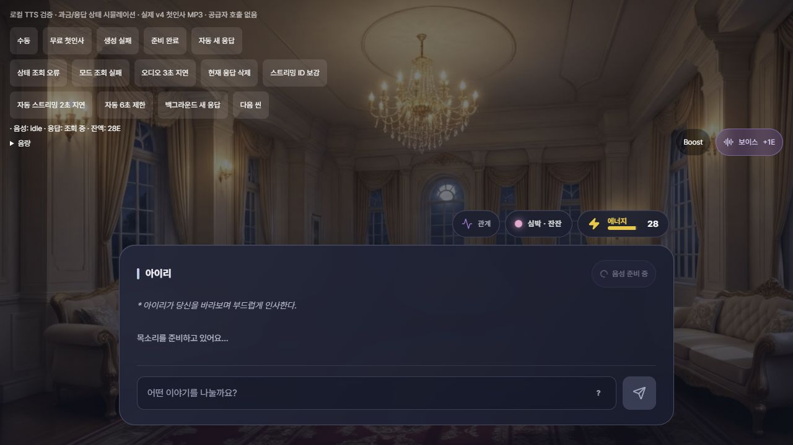

# TTS 표시·재생 타이밍 수정과 원화 그림체 점검

후속 관측(2026-10-07): 아래는 10/6 로컬 검증 시점 기록이다. 이후 사용자 승인으로 BE `b0f8f1f`/FE `a85ef38`을 푸시·운영 배포 완료했다. 실제 배포 및 보존 검증은 [docs/39](39_TTS_Studio_Production_Release_2026-10-07.md)를 참조한다.

기록일: 2026-10-06. 출처: 사용자 운영 청취 보고, FE `98fa3a2`/BE `d2a8895` 기준 코드, 생산 DB의 UGC23 배치 스냅샷과 기존 RunPod 완료 응답, 로컬 MP3 브라우저 fixture, 독립 소스 검토. **현재 수정은 로컬이며 푸시·운영 배포하지 않았다.** 운영 배포 사실은 [docs/37](37_TTS_Production_Rollout_RunPod_Queue_2026-10-06.md)이 정본이다.

## TTS 원인과 변경

- 첫 씬 SSE에는 저장 로그 ID가 없고 final_result 때 같은 대사 객체에 ID를 붙인다. DialogueBox의 객체 의존 타이핑/탭 초기화가 이를 새 씬으로 취급해 본문을 지웠다. 스트리밍 수신 때 표시 ID를 부여하고 모든 V1/V2 명시적 씬 복사에 보존한다. 표시 ID·실제 본문 변경만 타이핑/탭을 초기화하며, 오디오 소유권은 기존 room/log/sceneIndex로 계속 검사한다. 동일한 본문의 실제 다른 씬은 서로 다른 표시 ID다.
- 기존 자동 음성은 1.5초 폴링 후 매 씬에서 상태 GET→전체 MP3 GET→새 Audio→play 순서였다. 후속 씬도 선로딩이 없어 전송·디코딩 지연이 표시 뒤에 붙었다. 운영의 ‘약 1초’ 중 각 단계의 실시간 비중은 미측정이다.
- 자동 새 씬의 대사만 **최초 진입 기준 최대6초** 음성을 기다린다. 실제 `audio.play()` 시작 이후 타이핑한다. 이미지·장면 묘사는 먼저 표시하고 기존 대사 영역에서 준비 상태를 보여준다. 실패/미지원/AVAILABLE/모드 불명·OFF/비활성·hidden은 즉시 텍스트 폴백한다. 한 번 표시를 허용한 씬은 늦은 모드 응답·저장 ID 보강으로 재숨기지 않는다. 제한 시간 뒤 READY가 도착해도 늦은 자동 재생은 하지 않으며, 이미 생성된 음성은 수동 듣기로 이용한다. 과금·서버 생성 취소/환불 정책은 바꾸지 않았다.
- 자동 상태 폴링 간격은750ms(수동 생성의 기존1.5초 대기는 유지). 현재 소유 응답·attempt가 READY이면 다음 지원 씬2개의 MP3와 canplay를 메모리에 준비한다. 씬 이동만으로 캐시를 지우지 않으며 상태 GET을 통과한 뒤 사용한다. 수동 캐시 재생도 상태 GET을 다시 검사한다. 방/응답/attempt 변경·삭제·OFF·로그아웃/계정 토큰 변경·hidden·비활성·unmount는 관련 다운로드/미디어 준비를 취소하고 URL/Audio를 폐기한다. 공개 URL·영속 저장소·새 자동 POST를 만들지 않는다.
- BGM은 목소리 재생 중320ms에25%로 줄고 종료 후900ms에 복원한다. 사용자 음량×곡 전환 fade×voice duck을 한 경로에서 계산해 기존 fade timer와 충돌하지 않는다. mute/음량0/취소/unmount를 검증했다. Duck 변경은 ambience/SFX의 master 음량을 바꾸지 않는다.

## 원화 그림체 관측과 수정안

원화 WF1의 Git 체크포인트 지정 `wai_illustrious.safetensors`와 `detail_lora.safetensors`(model strength0.6), sampler 설정은 첫 도입 이후 변경되지 않았다. **실제 워커 모델 파일의 버전·해시 동일성은 확인하지 못했다.** 이번 GPT 모델 교체는 감정 파생 경로이며 원화 WF1을 교체하지 않았다.

UGC23 최초 완료 응답 ID는 초기 로컬 잡 기록과 일치했다. 최초 배치 스냅샷의 `soft rim lighting`, `warm backlighting`, `shallow depth of field` 등과 결과2개를 대응해 확인했으며 피부·옷·머리카락의 광택/입체 음영이 강했다. 현재 structured_concept는 그 뒤 외형 리롤 값으로 바뀌어 있으므로 최초 샘플의 입력이라고 혼동하면 안 된다. 후속 리롤 태그에는 `fashion photography`, `bokeh`, `depth of field`가 추가로 관측됐다. 두 배치 모두 품질 prefix만 있고 서버가 고정하는2D 스타일 앵커는 없었다. 사진 방향 태그와 스타일 제약 부재는 **기여 원인 가설**이며, 태그가 유일 원인이라는 증명은 아니다.

로컬 수정안:

- 초기·외형 리롤 구조화 프롬프트에 일본 서브컬처2D 일러스트 방향을 명시한다.
- WF1에 `anime illustration, 2d, cel shading`을 고정하고 알려진 명시 사진·3D·Disney/Pixar 토큰만 정확일치로 제외한다. 대소문자/underscore/단일 가중치 괄호를 정규화하며 `(photo: 1.2)`를 검증했다. 임의의 모든 스타일 표현을 차단하는 보안 필터는 아니다.
- WF1 negative에3d/cgi/photorealistic/photo/disney/pixar를 추가한다. 조명·bokeh/DOF·광택 입술·외형/소품을 일괄 제거하지 않는다. 체크포인트/LoRA/sampler와 **승인된 Qwen+후처리 Neutral, GPT Sunburst Low/리롤 High 감정 파생**은 유지한다.
- 어드민 DTO 기존 `negative`는 WF2 값으로 호환 유지하고 `goldenShotNegative`를 추가해 WF1을 구분한다. 현재 코드로 재구성한 값이며 과거 실제 제출 payload를 증명하는 값은 아니다. 별도 어드민 클라이언트의 새 필드 표시 변경은 미실행이다.

**새 원화 이미지 생성·품질 A/B는 미실행.** 기존 샘플을 조회했으며 유료 공급자 생성은 추가 호출하지 않았다. 보정 후2D 효과, 얼굴/의상 보존 및 cel shading의 질감 다양성 변화는 실제 샘플로 확인해야 한다.

## 검증

FE: production build, TDZ141파일, 기존 entry69, TTS 식별 계약16, 신규 voice-media 동작 검사가 통과했다. 신규 검사는 응답/attempt 캐시 재사용·교체, 다운로드/canplay 취소, 미디어 실패, BGM track×duck·mute·음량0·dispose를 다룬다. Build의 기존 bundle 크기/동적 import/Browserslist 경고는 남아 있다.

브라우저는 개발 전용 adapter와 기존 공식 첫인사 MP3를 사용해 공급자 호출·실제 지갑 변경 없이 검사했다. 초기 저장 ID 보강700ms 후 텍스트 감소/재타이핑이 없었다. 최종 저장본의 자동 스트리밍(인위적 MP3 지연2초)은 재생3841ms/첫 글자3881ms(차이40ms), 선로딩한 후속 씬은 재생234ms/첫 글자275ms(차이41ms)였다. 이는 로컬 fixture 측정이며 운영 공급자 지연 개선 수치가 아니다. 8.5초 MP3 지연에는 최초 글자6082ms로 제한 시간 폴백, 뒤늦은 autoplay 없음. 모드 조회2.5초 지연·실패, hidden 중 새 씬·상태 재확인도 검사했다. 모드 지연 시험이 roomId 초기화에서 release 기록을 지우는 회귀를 찾아 수정한 뒤 fresh reload에서 재타이핑 없음도 확인했다.

BE: UgcPromptAssembler7/UgcWorkflowFactory11 =18개, 실패·오류0. 실제 관측 사진 태그 제거, 정상 외형·소품 보존, Neutral 프롬프트 불변, 여성/남성(추가 negative 포함) WF1 제출과 인스펙션 값의 동일성을 검사했다. 관련 BE 소스·테스트 전체는 컴파일됐다. 다른 기능 전체 회귀검사는 이번 변경에서 재실행하지 않았다.

독립 컨텍스트 검토2개를 수행했다. TTS의 모드 지연 재숨김/hidden 버튼 정체/재생 flag 잔존을 보완했고 최종 blocker 없음으로 재검토됐다. 스타일 검토의 가중치 태그 assertion·male negative 일치·인스펙션 분리를 반영했다. 검토자는 운영 쓰기·유료 생성·파일 수정을 하지 않았다.

미실행: 이 변경의 운영 배포 및 운영 로그인 자동/수동 TTS E2E, 실제 운영 음성 지연 구간별 계측, 원화 보정 후 새 이미지 비교, 실제 worker 모델 파일 해시. 기존 별도 UIUX23/디오라마/실험 도구 변경은 본 작업에 포함하지 않았다.

음성 준비 중 표시(개발 fixture, 실제 과금 없음):

